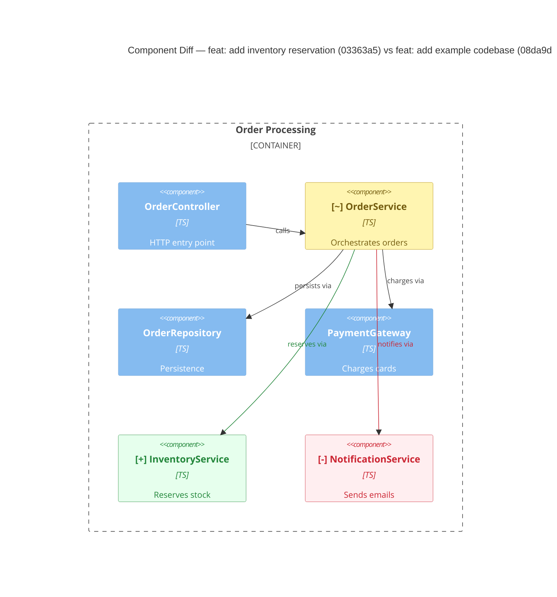

# C4 Diff Diagrams

Turn a git change (two commit-ish references) into three C4 **component** diagrams — `before`, `after`, and a combined `diff` with a red/green/amber overlay — so a reviewer can validate the *system-level* impact of a change without reading every line.

This is review-grade documentation, not a modeling platform. Favor a small, honest, traceable diagram over an exhaustive one.

## When this applies

Use this whenever the task involves comparing the structure of the code at two points in history: a PR, a branch vs its base, a single commit, or an arbitrary `<base>..<head>` range. If only one reference is given, diff it against its parent (`<sha>~1`) or the merge-base with the default branch — state which you chose.

## Inputs

- `base` — the "before" commit-ish (SHA, tag, branch). Required.
- `head` — the "after" commit-ish. Defaults to `HEAD`.
- `out` — output directory. Defaults to `./artifacts`.

Confirm these before doing work if any are ambiguous. Resolve each reference to its commit metadata so the reader gets the same context GitHub shows — short SHA, subject line, author, and date — not just an opaque hash:

```bash
git show -s --format="%h %s (%an, %ad)" --date=short <base>
git show -s --format="%h %s (%an, %ad)" --date=short <head>
```

Use this metadata in every diagram title and artifact heading.

### Diffing a PR

A PR is just a `base`/`head` pair, but pick the right `base`: use the **merge-base** where the branch forked, not the base branch's current tip. Otherwise unrelated commits that landed on the base branch after the fork leak into the diff and misattribute changes to the PR.

```bash
# PR of `feature` into `main`
base=$(git merge-base main feature)   # where the branch diverged
head=feature                          # PR tip
git diff --name-status "$base" "$head"
```

This mirrors exactly what GitHub's "Files changed" tab shows. If the branches aren't fetched locally, fetch them first (`git fetch origin main feature`).

## Core principles

The value of these diagrams collapses if a reviewer can't trust them, so hold to three things:

1. **Traceable.** Every node and edge must correspond to real code you read — a class/module and an actual import, call, or reference. Note the evidence (file path + symbol). If you can't point to the code, don't draw it.
2. **Deterministic intent.** Derive structure from the code, not from what you assume the author *meant*. Don't invent relationships to make the picture tidy.
3. **Focused.** Diagram the **impacted subgraph**. Components touched by the changed files, plus their immediate neighbors (one hop) for context. Everything else is noise that hides the signal.

## Workflow

### 1. List what changed

```bash
git diff --name-status <base> <head>
```

`A`/`M`/`D`/`R` tell you added / modified / deleted / renamed files. Renames matter: a renamed or moved file is usually the *same* component, not a remove+add, so treat `R` (and content-identical delete+add pairs) as a moved/renamed node, which is a **change**, not an add and a remove.

Filter out noise that isn't architecture: tests, generated code, lockfiles, build output, docs. Keep the set of source files that define or wire up components.

### 2. Map files to components

At component level, treat each **class / primary exported module** as a component. Read the changed files (and their close neighbors) to identify:

- The components each file defines.
- The relationships out of those components: imports/`require`, constructor injection, direct calls, instantiation. Each relationship needs concrete evidence.

Read file content **at each commit** without disturbing the working tree:

```bash
git show <base>:path/to/file.ts    # before
git show <head>:path/to/file.ts    # after
```

A file missing at one side (command errors) means the component was added or removed there — useful signal.

### 3. Build the two graphs

Construct a `before` graph (at `base`) and an `after` graph (at `head`), each limited to the impacted subgraph + one hop of neighbors:

- **Nodes**: `{ id, name, path }` — one per component.
- **Edges**: `{ from, to, kind, evidence }` — `kind` is the relationship (e.g. `imports`, `calls`, `injects`).

Compute the one-hop neighborhood over the **union** of the before and after graphs, not each side in isolation. That way a *removed* node still pulls in the neighbors it used to touch, those neighbors are exactly what make the removal legible to a reviewer. Don't expand to neighbors-of-neighbors; one hop is the budget.

Keep node `id`s stable across before/after (based on the component's identity, not its file path) so the diff can match them even across renames/moves.

### 4. Diff the graphs

Compare `before` and `after`:

| Element | Added | Removed | Changed |
|---------|-------|---------|---------|
| **Node** | in `after` only | in `before` only | in both, but renamed/moved, or its set of in/out edges changed |
| **Edge** | in `after` only | in `before` only | same endpoints, but direction flipped, target changed, or kind changed |

When in doubt between "changed" and "add+remove", prefer **changed** if the component keeps its identity (same responsibility, renamed/moved). This keeps the reviewer oriented instead of making context disappear.

### 5. Render three diagrams

All three are `C4Component` Mermaid diagrams over the same impacted subgraph.

- **`before`** — the graph at `base`, no overlay.
- **`after`** — the graph at `head`, no overlay.
- **`diff`** — the *union* of both graphs, color-overlaid so added/removed/changed elements stand out and unchanged elements provide context.

#### Diff color overlay

Apply these with `UpdateElementStyle` (nodes) and `UpdateRelStyle` (relationships). Removed elements stay in the diagram (so context isn't lost) — the color, not absence, communicates removal.

| State | Meaning | Node style | Edge style |
|-------|---------|-----------|-----------|
| Added | green | `$bgColor="#e6ffed", $borderColor="#22863a", $fontColor="#22863a"` | `$lineColor="#22863a", $textColor="#22863a"` |
| Removed | red | `$bgColor="#ffeef0", $borderColor="#cb2431", $fontColor="#cb2431"` | `$lineColor="#cb2431", $textColor="#cb2431"` |
| Changed | amber | `$bgColor="#fff5b1", $borderColor="#b08800", $fontColor="#735c0f"` | `$lineColor="#b08800", $textColor="#735c0f"` |
| Unchanged | default | (no style) | (no style) |

Prefix labels so the diagram survives being viewed without color (accessibility, plain-text diffs): `"[+] NewComponent"`, `"[-] OldComponent"`, `"[~] ChangedComponent"`.

The six hex codes are easy to transcribe wrong by hand. Copy the style lines you need verbatim from this block rather than retyping them. Swap in your node/edge ids and delete the states you don't use:

```
%% added (green)
UpdateElementStyle(ID, $bgColor="#e6ffed", $borderColor="#22863a", $fontColor="#22863a")
UpdateRelStyle(FROM, TO, $lineColor="#22863a", $textColor="#22863a")
%% removed (red)
UpdateElementStyle(ID, $bgColor="#ffeef0", $borderColor="#cb2431", $fontColor="#cb2431")
UpdateRelStyle(FROM, TO, $lineColor="#cb2431", $textColor="#cb2431")
%% changed (amber)
UpdateElementStyle(ID, $bgColor="#fff5b1", $borderColor="#b08800", $fontColor="#735c0f")
UpdateRelStyle(FROM, TO, $lineColor="#b08800", $textColor="#735c0f")
```

When a relationship maps to one obvious call, you may put that symbol in the relationship's technology slot: `Rel(orderService, inventoryService, "reserves via", "reserve(order)")`, so the evidence travels *with* the diagram instead of living only in prose. Keep it to the single call that best represents the edge; skip it when the edge is a bundle of interactions.

#### Diff diagram example

Put the human-readable commit context in the title so the diagram is self-describing when pasted into a PR:



### 6. Write artifacts

Write three files to `<out>/` (default `./artifacts/`):

- `before.component.md`
- `after.component.md`
- `diff.component.md`

The color legend and overlay belong **only** in `diff.component.md`. `before` and `after` are plain single-state snapshots — no legend, no `[+]/[-]/[~]` prefixes, no styling, because there's nothing to compare against and a legend implies color that isn't there.

Each file contains the Mermaid diagram plus a short **Evidence** section: a bullet per node/edge that changed, citing the file path and symbol that justifies it. This is what makes the diagram reviewable rather than decorative.

End with a one-paragraph summary answering the reviewer's three questions: *What new parts exist? What was removed? What relationships changed?*

## Artifact template

Use this structure for each artifact file. Lead with the commit context so a reader knows exactly what two points in history are being compared:

```markdown
# Component Diagram (diff)

**Base:** `08da9df` — feat: add example order-processing codebase (Jo Van Eyck, 2026-07-14)
**Head:** `03363a5` — feat: add inventory reservation, drop order notifications (Jo Van Eyck, 2026-07-14)

```mermaid
C4Component
  ...
```

## Legend
🟢 added  🔴 removed  🟠 changed  ⚪ unchanged (context)

## Evidence
- 🟢 `InventoryService` — new component in `src/inventoryService.ts`; wired in `src/orderService.ts` (`this.inventory.reserve(...)`).
- 🔴 `NotificationService` — deleted `src/notificationService.ts`; removed field/usage in `src/orderService.ts`.
- 🟠 `OrderService` — dependency set changed (gained `InventoryService`, dropped `NotificationService`) in `src/orderService.ts`.

## Summary
One paragraph: what's new, what's gone, what relationships changed.
```

## Keep it honest

- If the change touches nothing architectural (formatting, comments, config), say so plainly and produce a diff diagram that states "no structural change" rather than manufacturing one.
- Component diagrams show *structure*, not *sequence*. If only the call order changed (e.g. a step moved earlier) but the dependency set didn't, that is **not** a structural change — don't render it as one. Note it in a single line of the summary if it matters, but never invent nodes or edges to represent ordering; the diagram can't express it and a reviewer will be misled. The impacted component can be colored "changed" to indicate that behaviour changed.
- Don't infer relationship *types* you can't see in code (e.g. "async message" vs "sync call") unless there's an explicit construct proving it.
- Stay under ~20 elements per diagram; if the impacted subgraph is larger, focus on the components that actually changed and their direct neighbors.
